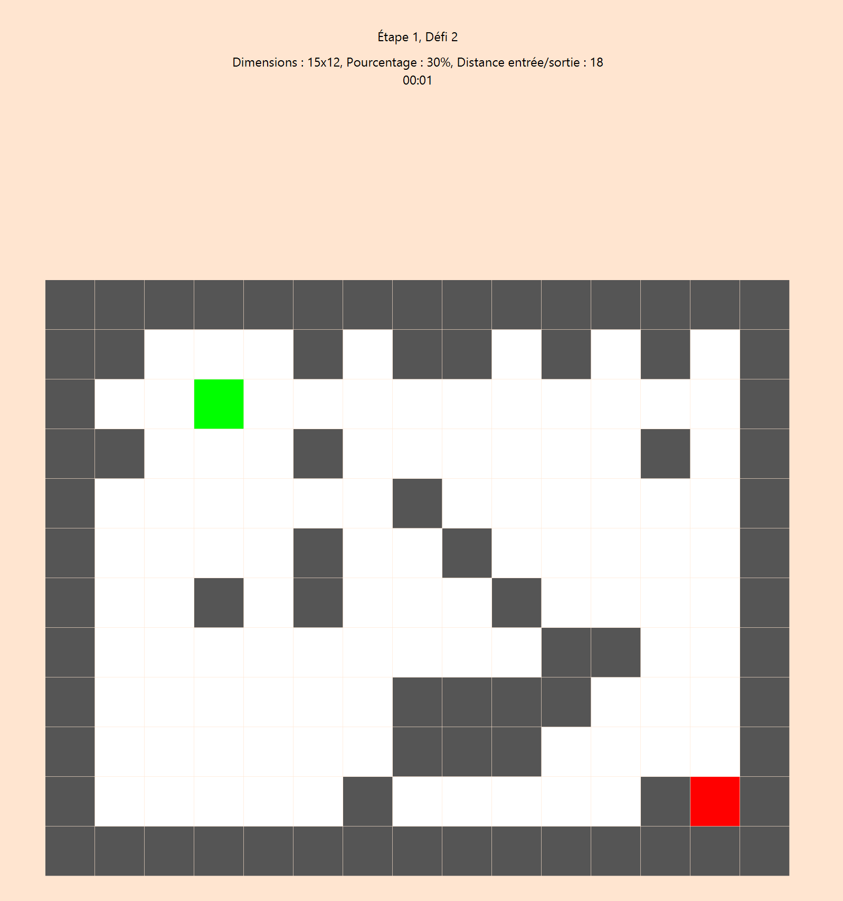
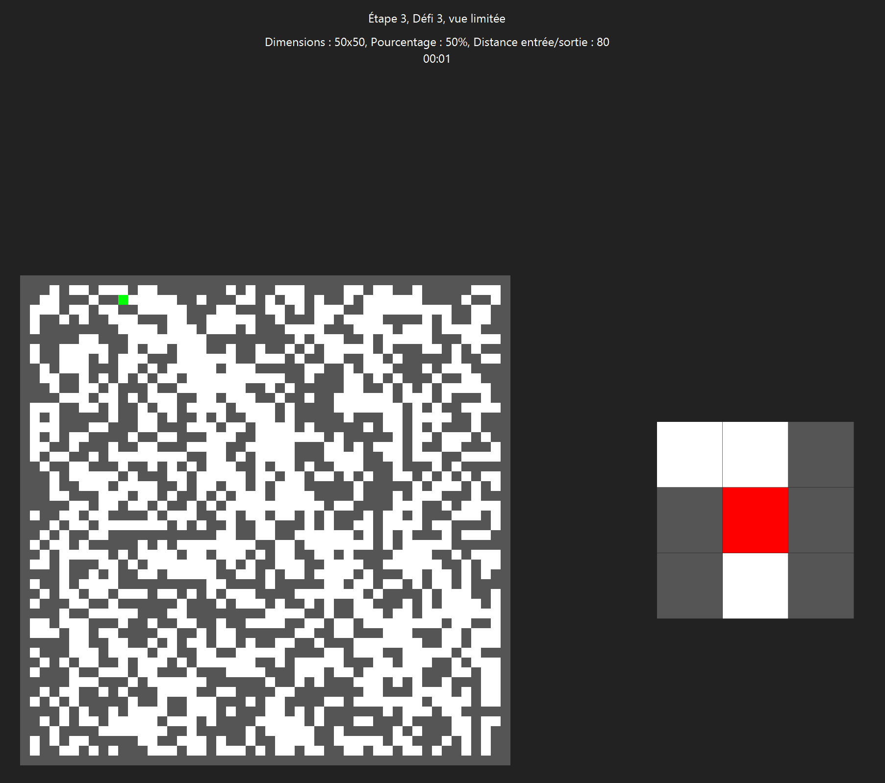
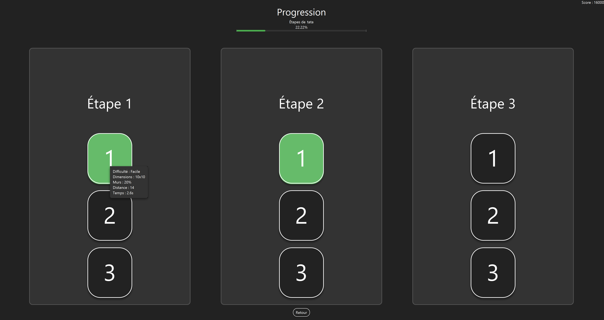

<div align="center">

# SAÉ S3.02 - Labyrinthe


**[Présentation](#présentation)** • **[Équipe](#membres-de-léquipe)** • **[Liens utiles](#liens-utiles)** • **[Diagramme de classe](#diagramme-de-classe)** • **[Démonstrations](#démonstrations)**

</div>

## Présentation
Le but de cette SAÉ est de créer une application de jeu de labyrinthe proposant différents modes de jeu.
Le joueur doit rejoindre la sortie du labyrinthe, généré de manière aléatoire, tout en faisant face à diverses contraintes selon le mode choisi.

L’application comporte deux modes de jeu principaux :

1. **Mode libre** : 

    - le joueur peut choisir la taille du labyrinthe (largeur, hauteur) ainsi que le pourcentage de murs.

2. **Mode progression** : 

    - Le joueur avance à travers plusieurs niveaux de difficulté croissante.

    - Chaque étape comporte trois défis : facile, moyen et difficile.

    - Certains niveaux imposent une restriction de vision (le joueur ne voit qu’autour de lui).

Un système de sauvegarde enregistre la progression à partir du pseudo saisi par le joueur.

### Fonctionnalités originales

Nous avons conçu un système de pièges et d’entités entièrement modulaire, permettant de créer une grande variété de configurations et de comportements. Le mode multijoueur pousse encore plus loin cette modularité en offrant la possibilité d’affronter d’autres joueurs et de tenter de remporter la partie face à ses adversaires, en arrivant le premier à une sortie, que ce soit par la rapidité de mouvement, ou par les composants du labyrinthe (monstres) ayant éliminé les autres joueurs.

## Membres de l'équipe
Réalisé par :
- **Victor Bredelle** : [victor.bredelle.etu@univ-lille.fr](mailto:victor.bredelle.etu@univ-lille.fr)  
- **Antonin Marouze** : [antonin.marouze.etu@univ-lille.fr](mailto:antonin.marouze.etu@univ-lille.fr) 
- **Romain Harlaut** : [romain.harlaut.etu@univ-lille.fr](mailto:romain.harlaut.etu@univ-lille.fr)  
- **Angèl Zheng** : [angel.zheng.etu@univ-lille.fr](mailto:angel.zheng.etu@univ-lille.fr)   
- **Baptiste Lavogiez** : [baptiste.lavogiez.etu@univ-lille.fr](mailto:baptiste.lavogiez.etu@univ-lille.fr)  

## Liens utiles

Mme Boneva : [Rapport d'analyse](rendus/analyse/rapport/G2_SAE3.3-Rapport_Analyse.pdf)

Mr Delecroix :

| Documents | Code |
|-----------|------|
| [Suivi](labyrinth/suivi.md) | [Répertoire principal](labyrinth/src/main/java/fr/univlille/labyrinth) |
| [Rapport UML](rapports/UML/uml.md) | [Répertoire de tests](labyrinth/src/test/java/fr/univlille/labyrinth) |

Mme Everaere : [Rapport algorithmique](rendus/algo/rapport/G2_SAE3.3-Rapport_Algorithmie.pdf)

**Le code se trouve dans le répertoire `labyrinth`.**

## Diagramme de classe

Afin de ne pas surcharger le README, le diagramme UML ainsi que les choix de conception seront détaillés dans un fichier à part accessible à : [Rapport UML](rapports/UML/uml.md)

## Lancer le projet
### Prérequis

Pour exécuter le projet, vous aurez besoin de :

- **Java 17** installé
  ```bash
  java -version
  ```

* **Maven** installé

  ```bash
  mvn -v
  ```
 
* Installer **JavaFX 17** sur votre machine :

  ```bash
  sudo apt install openjfx
  ```

  > JavaFX sera installé dans `/usr/share/openjfx/lib`.

## Exécution du projet

Il existe plusieurs façons de lancer le jeu Labyrinth :

### Avec Maven

```bash
cd labyrinth
mvn javafx:run
```

> Attention, cette méthode utilise Maven pour gérer JavaFX automatiquement.

---

### Avec les scripts `compile.sh` && `run.sh`

Si JavaFX n’est pas encore installé, faites :

```bash
sudo apt install openjfx
```
Vous aurez aussi besoin de GStreamer (ce framework permet de gérer les médias, comme la vidéo en fond)
```bash
sudo apt install libgstreamer1.0-0 gstreamer1.0-plugins-base gstreamer1.0-plugins-good gstreamer1.0-plugins-bad gstreamer1.0-plugins-ugly gstreamer1.0-libav
```
Tout d’abord, placez-vous dans le répertoire labyrinth puis compilez le projet avec la commande suivante (en veillant à bien avoir les dépendances requises) :
```bash
cd labyrinth
./compile.sh
```

Ensuite, exécutez avec :
```bash
./run.sh
```

>Vérifiez que vous avez les droits nécessaires sur les fichiers, et assurez-vous que vos bibliothèques JavaFX se trouvent bien dans `/usr/share/openjfx/lib`

## Démonstrations








## Documentation

Consultable dans `labyrinth/doc` et générable avec le script `./generate_javadoc.sh`.
