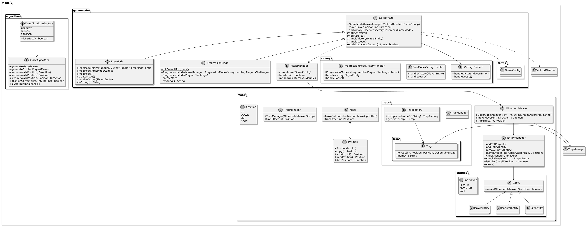
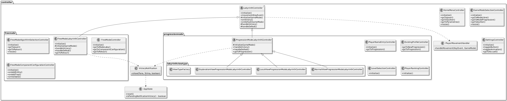
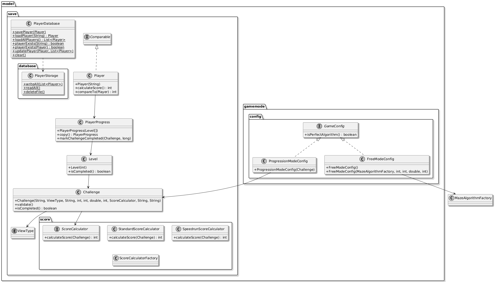
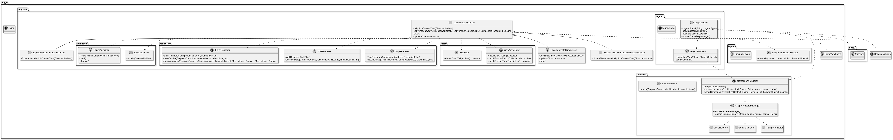
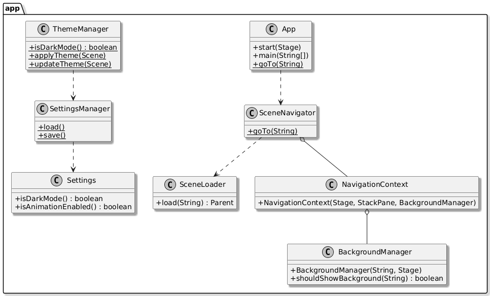

# Rapport : UML & Choix de Conception

L'architecture de l'application se compose sous la forme suivante, en plusieurs diagrammes à différentes granularités.

Les choix de conception évoqués seront globaux et évoqueront la logique générale plutôt que celle des éléments cibles. Ces choix seront guidés par :

- Les principes **SOLID, DRY, KISS, YAGNI...**
- La volonté d'éviter *l'over-engineering*

**Il est conseillé de lire la présentation au préalable afin de comprendre toutes les fonctionnalités référencées.**

---

# Sommaire

**[Modèle](#modèle)**  

**[Controllers](#controllers)**  

**[Persistence et configuration](#persistence-et-configuration)**  

**[Vue et rendu](#vue-et-rendu)**  

**[Navigation de l'application](#navigation-de-lapplication)**  

**[Tests](#tests)**  

**[Conclusion](#conclusion)**  

---

## Modèle

### Choix de conception

La classe `GameMode` mutualise les comportements communs aux deux modes de jeu : `FreeMode` et `ProgressionMode`.

Un labyrinthe immobile est un `Maze`. Il contient uniquement les murs. Cette distinction est importante puisqu'elle permet l'inversion des dépendances vis-à-vis de l'algorithme, qui ne voit que le `Maze` pour ce dont il a besoin. `Maze` expose maintenant ses attributs principaux :

- ses dimensions  
- son entrée / sortie  
- sa distance  
- son pourcentage  
- ses murs  

et ses constructeurs, ce qui simplifie la dépendance aux algorithmes (`MazeAlgorithm`).

`ObservableMaze` hérite de `Maze` et permet d'ajouter des composants, s'agissant de pièges ou d'entités. Les entités sont des agents capables de changer de position dans le labyrinthe. Il s'agira ici de sorties, de joueurs et de monstres. Les pièges sont immobiles et, à leur déclenchement, déplacent le joueur. Les joueurs sont des entités particulières, car ils sont les seuls capables de déclencher le mouvement.. Ainsi, ils comportent un `ID`, dans le mode solo étant toujours à 0, et dans le mode multijoueur désignant l'identifiant du joueur joué. Les gestionnaires (`EntityManager`, `TrapManager`) et les observateurs du labyrinthe sont affichés pour refléter le code.

`MazeManager` porte la validation des dimensions et gère la création de `ObservableMaze`. `MazeAlgorithmFactory` liste l'ensemble des algorithmes disponibles avec `getAlgorithm()`. Le pattern Factory permet une création simple. 

Les algorithmes implémentés sont des Singletons. Ils ne seront pas détaillés ici, car le rapport de *Développement Efficace* en tient déjà compte.

De cette façon, lors du jeu dans le contrôleur, notre joueur 1 se déplace avec les flèches, tandis que le 2ème peut avec ZQSD, le troisième avec IJKL... et ce sur un joueur distinct.

---

## Controllers

### Clarifications

Notre application utilise, pour toutes ses vues, des pages FXML, stockées dans le dossier `ressources`. Le nommage se doit alors d'être constant ; la classe de contrôleur a le même nom + `Controller` que sa page FXML référencée. Cela permet de rendre le code plus maintenable.

### Choix de conception

La logique **SOLID** et particulièrement le **DRY** implique ici une abstraction ; les différents contrôleurs d'étapes, responsables de l'initialisation des parties du modèle, de la vue et de leur liaison, réalisent beaucoup de comportements communs. La classe `LabyrinthController` est parente de tous les contrôleurs de labyrinthe. De ce fait, il est très simple d'ajouter une nouvelle vue ; on peut noter, par exemple, que des contrôleurs comme `ExplorationViewProgressionModeLabyrinthController` font moins de 20 lignes de code ; en l'occurrence, ce contrôleur s'occupe uniquement de *override* la méthode `setupView`, dont le retour est mis dans le conteneur `StackPane`.

`AppState` reflète l'état applicatif complet (joueur, niveau/défi sélectionné, configuration du mode libre, notification en attente), et `PlayerMovementHandler` est placé dans le sous-package `controller.input` pour clarifier son rôle. Ce sous-package permet d'être ouvert à l'éventuelle extension de nouveaux types d'entrées utilisateurs :

- vocaux  
- visuels...

### Rapport avec le MVC

Les `LabyrinthController` sont des `VictoryObserver<GameMode>` qui, lorsque notifiés par le `GameMode` qu'un joueur est sur une sortie, invoquent leur méthode `handleVictory`. Il en est de même pour la logique de défaite (plus aucun joueur restant), invoquant `handleDefeat`.

Ces méthodes peuvent être surchargées : par exemple, lors de la victoire, un `ProgressionModeLabyrinthController` redirige vers la sélection de niveaux, tandis qu'un `FreeModeLabyrinthController` redirige vers un nouveau niveau (donc sa propre page). Le désabonnement se réalise alors par le *Garbage Collector*, puisque l'ancienne page n'est plus référencée.

C'est là l'intérêt d'avoir conceptualisé par l'abstraction ; décider d'implémentations, de comportements différents plus facilement grâce à la modularité acquise.

---

## Persistence et configuration

### Choix de conception

Il a été fait le choix de la sérialisation de la classe `Player`, contenant des `Challenge` (défis). Un défi contient donc toutes les caractéristiques du labyrinthe qui lui sera correspondant. Puisqu'il contient un algorithme de labyrinthe, il sera stocké sous forme de valeur `String`, qui sera convertie dans la Factory. Lorsqu'un nouveau joueur est créé, il lui est attribué la progression par défaut (fichier CSV configurable) contenant les défis et étapes.

Puis, lorsqu'il reprend sa partie, sa configuration sérialisée sera chargée, et il pourra visualiser les défis qu'il a déjà complété et accéder aux niveaux qu'il a franchi. Le score est calculé en itérant, pour chaque défi, une valeur retournée selon la règle définie par le défi (Strategy pattern extensible). Un classement permet de visualiser les joueurs aux scores les plus élevés.

Les labyrinthes lancés sont paramétrés par des configurations.

La configuration est donc liée à cela : une interface `GameConfig` est utilisée par le `GameMode`, puisque la configuration 

- du mode progression se base sur les données des défis, 
- tandis que la configuration du mode libre se base sur les entrées utilisateur.

En somme, la conception est simple et modulaire vis-à-vis des configurations de labyrinthe, qu'elles soient instantanées ou persistantes.

### Clarifications

Par strict respect du MVC, seul le modèle réalise les actions de sauvegarde.

---

## Vue et rendu

### Choix de conception

La logique **SOLID** et particulièrement le **DRY** implique, à la manière des contrôleurs, une abstraction ; les différentes vues sont en réalité toutes des `Canvas`.  
Puisque notre application utilise des pages FXML, nos vues, à proprement parler en fichiers Java, sont alors des parties intégrées à la page, par leur contrôleur (nommage identique + `Contrôleur`). 

Un système de filtres / renderers de composants permet l'ouverture à l'extension en fonctionnant sur des données dynamiques plutôt que fixes. Ce système est également pensé, avec les constructeurs, pour permettre **l'injection de dépendances (D de SOLID)**. Ce système est utile pour les vues Locales / Exploration qui ne doivent pas forcément rendre compte de toutes les entités présentes. Par exemple, la vue d'exploration ne doit tenir compte que des murs explorés. Ces filtres permettent donc de pouvoir masquer les composants souhaités dans n'importe quelle vue.

D'autres vues n'étant pas des labyrinthes existent :

- panneaux d'informations établissant la liste des entités restantes  
- panneaux indiquant les pièges restants  

Ces vues observent également la classe `ObservableMaze` et, à chaque changement (piège déclenché, joueur éliminé) sont notifiées et mettent à jour leur liste. 

Les choix de conception sont donc plus que logiciels ; ils sont ici également relatifs à une expérience utilisateur qualitative, forte de retours récoltés pendant la phase de développement. 

### Rapport avec le MVC

Une vue enfant de `LabyrinthCanvasView` retourne donc un objet `Canvas` observant le modèle. Cet objet est intégré par le contrôleur dans son conteneur `StackPane`. Les vues sont donc abonnées par le contrôleur.

---

## Navigation de l'application

### Choix de conception

Le package `app` sert à naviguer dans l'application ; il s'agit de manipuler les paramètres et de changer de scène (Page). Puisque nous avons une vidéo de fond, un `BackgroundManager` existe. D'un autre côté, la classe `App` est le point d'entrée de l'application pour **Maven**.

---

## Tests

Les tests suivent exactement la même arborescence afin de s'y retrouver facilement. Le modèle est couvert au maximum.

---

## Conclusion

L’architecture proposée a été pensée de manière à rester évolutive tout en conservant une compréhension claire. 

Ces choix sont également détaillés dans :

- Le rapport d'analyse  
- Le rapport d'algorithmie  
- La Javadoc  
- La soutenance
